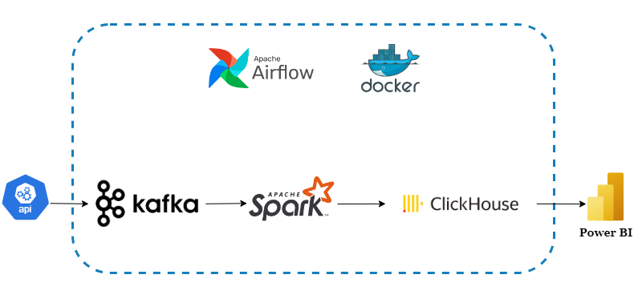
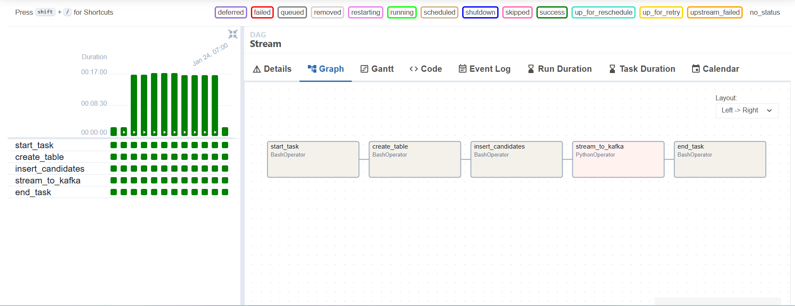
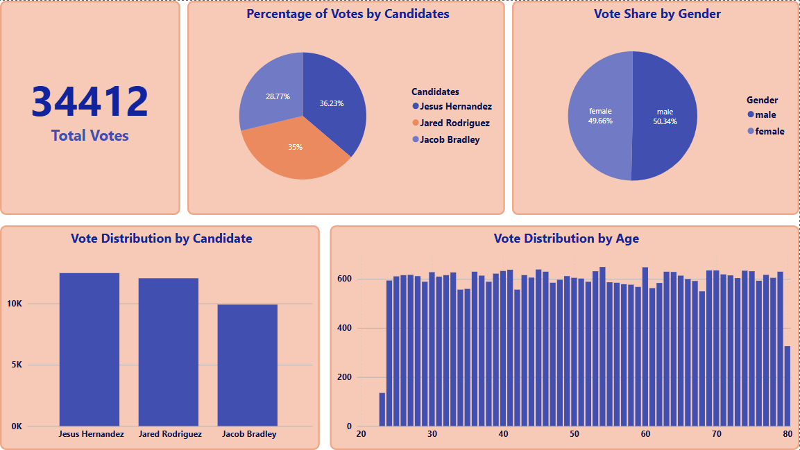
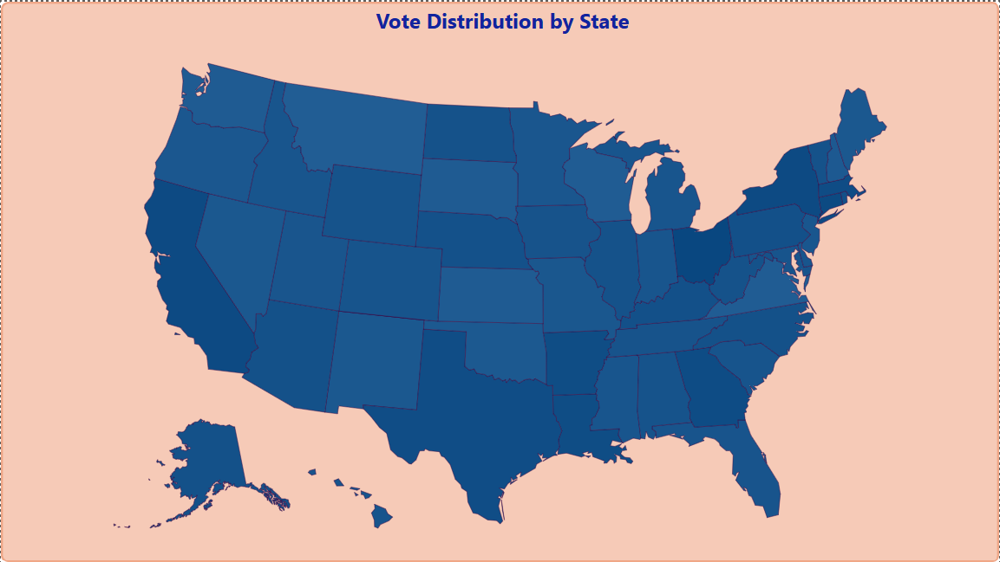

# Realtime voting system project

## Introduction
This project builds a data streaming pipeline using free user data from the [Random User API](https://randomuser.me/api?nat=us). The data streams to a Kafka topic, processed in batches by PySpark, and stored in ClickHouse. Power BI then visualizes the data from ClickHouse.
The workflow is automated with Apache Airflow and deployed via Docker for scalability and efficiency.

## Technologies Used
1. Python: Core for scripting and integration.
2. Kafka: Streams data from the API.
3. PySpark: Processes and batches data.
4. ClickHouse: Stores and queries data.
5. Power BI: Visualizes data insights.
6. Apache Airflow: Workflow management
7. Docker: Container platform

## Architecture
**Workflow**

**DAG Tasks**

## Dashboard

## How to run the project?
1. **Ensuring Docker is installed.**
2. **Ensuring ClickHouse is ready.**
3. **Run Docker:**
    - Using command: `docker compose up`
4. **Run Spark application on Docker:**:
    - Using command: `docker exec -it spark-master bash` to move to the spark container.
    - After that, run `pip install clickhouse-connect==0.8.14` and `pip install python-dotenv==1.0.1` to install necessary packages
    - Finally, submit job using command: `spark-submit --master local[*] --packages org.apache.spark:spark-sql-kafka-0-10_2.12:3.5.0,ru.yandex.clickhouse:clickhouse-jdbc:0.3.2 spark.py`
5. **Connect ClickHouse with PowerBI:**
    - Connect ClickHouse with PowerBI via ODBC driver or follow this tutorial: [Connecting to ClickHouse database server from PowerBI](https://medium.com/@annu.nmit/connecting-to-clickhouse-database-server-from-power-bi-864e950d83e2)
6. **Access the UIs:**
    - After run Docker, Airflow is already used, using web UI: `http://localhost:9999/`
    - Monitor Kafka, using web UI: `http://localhost:9021/`

## Documentation
- https://medium.com/@annu.nmit/connecting-to-clickhouse-database-server-from-power-bi-864e950d83e2
- https://clickhouse.com/docs